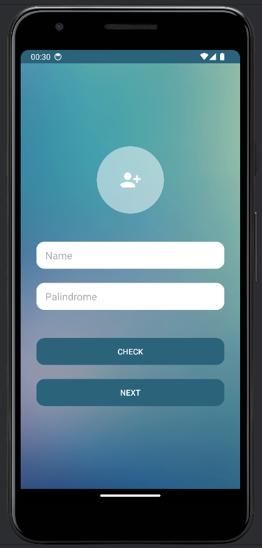
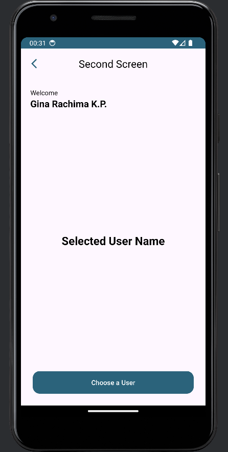

# Documentation

## Description
This is an application to fulfill Suitmedia competency test.
  
In the first page, user could check whether the text in Palindrome field is Palindrome or not. To go to the next page, user have to input name in the Name field. If user click the button without filling the required field, there will be an error notification on the input field.
  
In the second page, user could click the button to choose one user in the next page. Afterward, the chosen user's name will appear on the second page.
  
As mentioned before, the third page displays the list of user, insisting avatar, user firstname and lastname, and email.

## Application
Application could be downloaded [here](Apk/app-debug.apk)

## User Interface
- First Screen  

- Second Screen  

- Third Screen  

